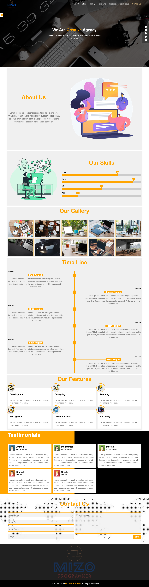
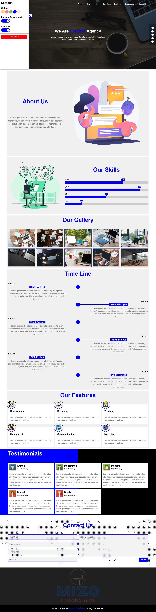

<h1>Landing page</h1>

  

<h2>Description</h2>

  This is a Landing page made by 
  <em>HTML</em> , 
  <em>CSS</em> and
  <em>JavaScript</em> languages.
  Inspired by 
  <strong>
    <a href="https://www.youtube.com/@ElzeroWebSchool">ElzeroWebSchool</a>
  </strong> 
  channel.

My goal from this project is to show my experience in Front-end web development.

<h3><u>Features:</u></h3>
<h4>At Settings:-</h4>
<ul>
  <li>Changing the global color of the landing page.</li>
  <li>Stop or run the background images animation.</li>
  <li>Hide or show the side nav of the important secions.</li>
  <li>Reset button, to set the default settings.</li>
</ul>

- Your settings will be add in the local storage of your browser, so it will be save after reloading or closing the website.

<h3><u>Functionality buttons:</u></h3>
<ul>
  <li>Navbar links to go throw sections.</li>
  <li>Navbar button to show and hide navbar links (max 991px screens).</li>
  <li>side nav buttons to go throw important sections.</li>
  <li>Gear icon button to open settings box.</li>
  <li>Setting's color buttons, check boxs, reset button.</li>
  <li>Gallery section's images to create a popup for the clicked image, and "X" button to remove it.</li>
</ul>

- Other buttons and links just for design.

<h3><u>Animations:</u></h3>
<ul>
  <li>hover animations.</li>
  <li>Image slider animation.</li>
  <li>Typing animation.</li>
  <li>Scrolling animation.</li>
</ul>

<h3><u>Responsiveness:</u></h3>

  The website is responsive, it created to use across all devices, such as modern desktops, tablets, and phone browsers.

>Please note that all images, videos and contents in this project are random and just
to show the design and the functionality of the website.

<h2>Screenshot</h2>
<h3><u>Default:</u></h3>

<h3><u>Settings:</u></h3>
